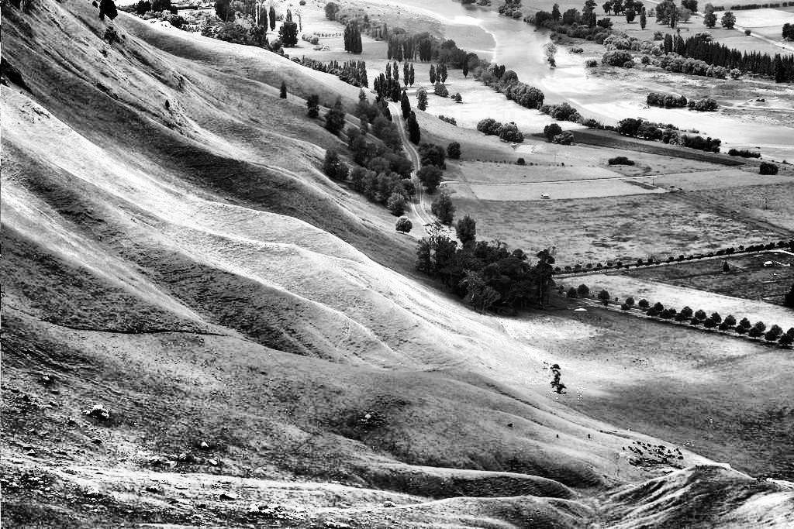

# Histogram Equalization

Histogram equalization is a technique used in image processing to improve the contrast of an image by redistributing the intensity values of pixels. The goal is to enhance the image's overall contrast, especially in areas with low contrast, by stretching the range of intensity levels.

  

## 1. Compute the Histogram

The first step is to compute the histogram of the image, which represents the frequency of each pixel intensity.

$$
H(r_k) = number\ of\ pixels\ with\ intensity\ r_k
$$

Where:

- rk  is the intensity value k (for grayscale images, k is between 0 and 255).

  

## 2. Compute the Probability Density Function (PDF)

To normalize the histogram, compute the Probability Density Function (PDF), which represents the relative frequency of each intensity.

$$
PDF(r_k) = \frac{H(r_k)}{N}
$$

Where:

- H(rk) is the histogram value for intensity rk,
- N is the total number of pixels in the image.

  

## 3. Compute the Cumulative Distribution Function (CDF)

Next, compute the cumulative distribution function of the histogram.

$$
CDF(r_k) = \sum_{i=0}^{k} PDF(r_i)
$$

Where:

- CDF(rk) is the cumulative sum of the PDF values from intensity 0 to k.

  

## 4. Map the Intensities

Use the CDF to map the original pixel intensities to the new enhanced intensities. The mapping scales the normalized CDF to the range [0, L-1], where L = 256 for 8-bit images.

$$
r_k' = round(CDF(r_k) \cdot (L - 1))
$$

Where:

- rk' is the new intensity value for each original intensity \( rk \),
- L is the number of intensity levels (for 8-bit images, L = 256).

Each pixel intensity in the input image is replaced using the transformation function

$$
T(r_k) = round(CDF(r_k) \cdot (L - 1))
$$

which is derived from the CDF.

---
## Extension to Colored Images (Channels Together)

To apply histogram equalization on a colored image while treating all channels together:

1. **Flatten All Channels**: Combine the intensities from all three color channels (R, G, B) into a single array to create a unified histogram. This ensures that the same transformation is applied across all channels.
  
2. **Perform Histogram Equalization**: Use the steps described above (compute the histogram, normalize to PDF, calculate the CDF, and map intensities) on the combined intensity data.
  
3. **Reshape Back to Original Size**: After applying the intensity mapping, reshape the equalized data back to its original dimensions for each channel.

---
## Local Histogram Equalization

Local histogram equalization improves the contrast of an image by applying histogram equalization to small regions (tiles) of the image, instead of the entire image. This technique is particularly useful in enhancing local details in low-contrast areas without overexposing other regions.

### Steps for Local Histogram Equalization:

1. **Define Local Regions**: The image is divided into small, non-overlapping tiles (e.g., 128x128 pixels), and histogram equalization is applied to each region independently.
   
2. **Calculate Local Histogram**: For each tile, compute the histogram of pixel intensities.

3. **Normalize Local Histogram (PDF)**: Normalize the histogram to get the Probability Density Function (PDF) for each tile.

4. **Compute Cumulative Distribution Function (CDF)**: Calculate the CDF of the tile's PDF to capture the cumulative pixel distribution.

5. **Map Intensities**: Map the pixel intensities in each tile using the transformation function derived from the CDF, similar to global histogram equalization.

6. **Reconstruct the Image**: After processing all tiles, combine the equalized tiles to reconstruct the final image.

### Formula for Local Transformation:

Given the CDF of a local tile:

$$
CDF_{local}(r_k) = \sum_{i=0}^{k} PDF_{local}(r_i)
$$

The pixel intensities are then mapped by:

$$
r_k' = round(CDF_{local}(r_k) \cdot (L - 1))
$$

Where the transformation is applied to each tile independently.

---
## Sliding Window Histogram Equalization

Sliding window histogram equalization is a variation of local histogram equalization, where the equalization is performed on overlapping regions of the image. This method allows for smoother transitions between neighboring regions and can be effective in enhancing local contrast without creating stark boundaries between tiles.

### Steps for Sliding Window Histogram Equalization:

1. **Define Sliding Window**: A window of fixed size (e.g., 256x256 pixels) is used, and it slides over the image, overlapping by 50% (e.g., a window with a 50% overlap will move half the window size at each step).

2. **Calculate Histogram for Each Window**: For each window, compute the histogram of pixel intensities.

3. **Normalize the Histogram (PDF)**: Normalize the histogram to get the Probability Density Function (PDF) for each window.

4. **Compute Cumulative Distribution Function (CDF)**: Calculate the CDF for the PDF of each window.

5. **Map Intensities**: For each pixel in the window, map the intensity to the new enhanced value using the transformation derived from the CDF.

6. **Apply the Transformation**: The transformation is applied to each pixel in the image, replacing its intensity with the corresponding value from the CDF.

7. **Reconstruct the Image**: The equalized pixel values are stored in the output image.

### Formula for Sliding Window Transformation:

Given the CDF of a sliding window:

$$
CDF_{window}(r_k) = \sum_{i=0}^{k} PDF_{window}(r_i)
$$

The pixel intensities are then mapped by:

$$
r_k' = round(CDF_{window}(r_k) \cdot (L - 1))
$$

Where the transformation is applied to each pixel in the sliding window independently.

### Key Difference from Local Histogram Equalization:
- In **local histogram equalization**, each region is processed independently without overlap, while in **sliding window equalization**, the windows overlap by a defined percentage (typically 50%) for smoother transitions between regions.

---
## Adaptive Histogram Equalization (AHE) and CLAHE (Contrast Limited Adaptive Histogram Equalization)

Adaptive Histogram Equalization (AHE) is an enhancement technique that adjusts the contrast of an image locally by applying histogram equalization in small regions (tiles) of the image. AHE helps improve the visibility of features in different regions of an image, especially in cases where global histogram equalization may fail to highlight fine details.

### CLAHE (Contrast Limited AHE)

CLAHE (Contrast Limited Adaptive Histogram Equalization) is a variation of AHE where the contrast enhancement is limited to avoid over-amplification of noise. This limitation is controlled using a **clip limit**, which defines the maximum allowable histogram bin value in each tile. Excess pixels above this limit are redistributed to prevent noise enhancement.

### Steps for Adaptive Histogram Equalization (AHE) with CLAHE:

1. **Divide the Image into Tiles**: The image is divided into non-overlapping regions (tiles). Each tile will be independently equalized.
   
2. **Calculate the Histogram for Each Tile**: For each tile, compute the histogram of pixel intensities.

3. **Normalize the Histogram (PDF)**: Normalize the histogram to form the Probability Density Function (PDF) for each tile.

4. **Clip the Histogram (for CLAHE)**: A clip limit is applied to the PDF. If any bin exceeds the clip limit, the excess is redistributed evenly across all bins.

5. **Compute the CDF (Cumulative Distribution Function)**: Calculate the CDF based on the clipped PDF.

6. **Create the Transformation Function**: The CDF is used to generate a transformation function that maps pixel intensities to new enhanced values.

7. **Interpolate Between Tile Transformations**: After applying CLAHE to each tile, the transformations are interpolated between neighboring tiles to ensure smooth transitions across tile borders.

8. **Apply the Transformation**: The transformation is applied to each pixel in the image using the interpolation results.

### Formula for CLAHE Transformation:

For each tile:
- Calculate the histogram and normalize it.
- Apply the clip limit to the PDF, redistribute excess values.
- Compute the CDF and create the transformation function:

$$ T(r_k) = round(CDF_{clipped}(r_k) \cdot (L - 1)) $$

Where:
- rk is the pixel intensity.
- L is the number of intensity levels (typically 256 for 8-bit images).
- CDFclipped(rk) is the cumulative distribution function of the clipped histogram.

### Interpolation of Tile Transformations:

To ensure smooth transitions between tiles:
- The transformations from neighboring tiles are weighted based on their relative positions in the image.

Additionally, Adaptive Histogram Equalization can also be used for Sliding Window cases besides Local.

---
# Test cases
|  |  |
|---|---|
|   |   |
| Low contrast greyscale image | Global Histogram Equalization |
|   |   |
| Low contrast greyscale image | Local Histogram Equalization |
|   |   |
| Low contrast greyscale image | Sliding Window Histogram Equalization |
|   |   |
| Low contrast greyscale image | Adaptive Local Histogram Equalization |
|   |   |
| Low contrast greyscale image | Adaptive Sliding Window Histogram Equalization |

|  |  |
|---|---|
|   |   |
| Low contrast color image | Global Histogram Equalization |
|   |   |
| Low contrast color image | Local Histogram Equalization |
|   |   |
| Low contrast color image | Sliding Window Histogram Equalization |
|   |   |
| Low contrast color image | Adaptive Local Histogram Equalization |
|   |   |
| Low contrast color image | Adaptive Sliding Window Histogram Equalization |

|  |  |
|---|---|
|   |   |
| Underexposed dark color image | Adaptive Local Histogram Equalization |
